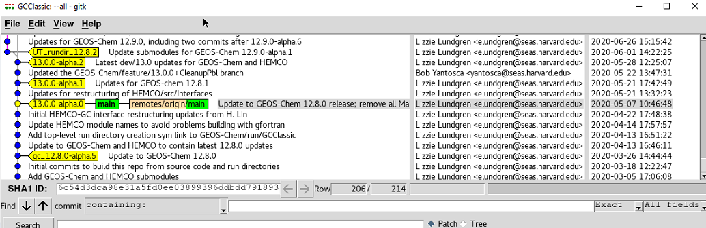
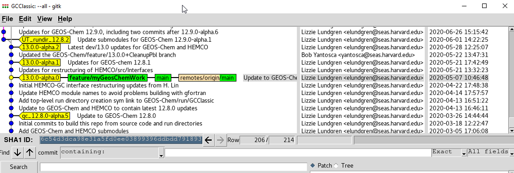
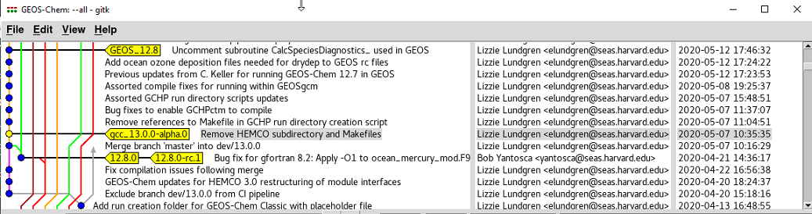
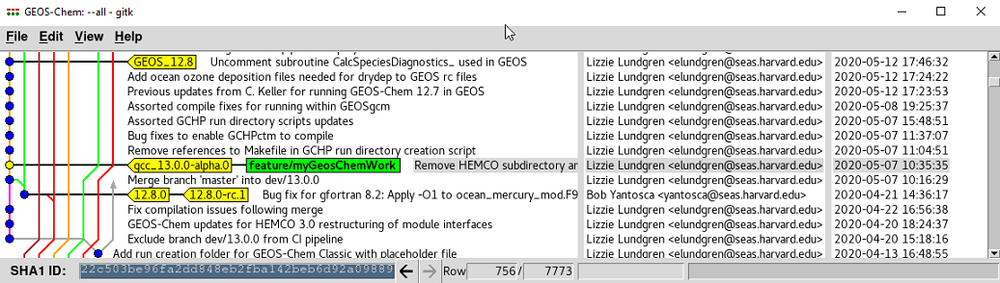
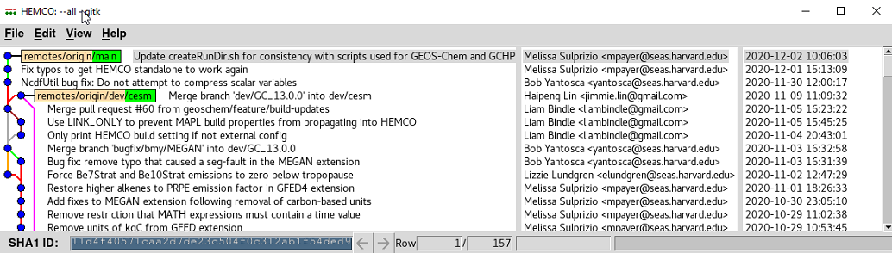
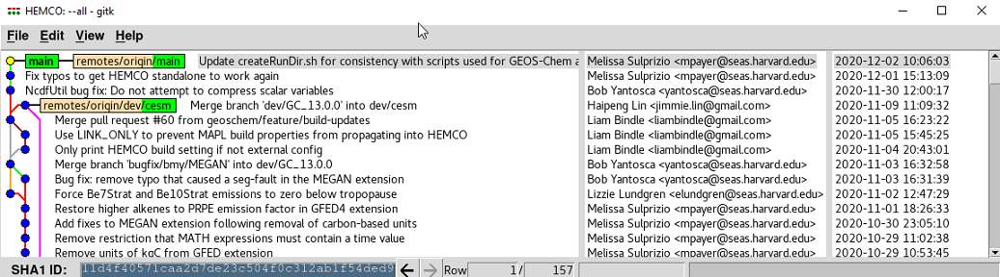

Downloading GEOS-Chem
=====================

Starting with `GEOS-Chem 13.0.0 <GEOS-Chem_13.0.0>`__ and later
versions, the GEOS-Chem source code has been split up into 3 Github
repositories:

+---------------+-------------------------+-------------------------+
| Name          | Stored at               | Description             |
+===============+=========================+=========================+
| **GEOS-Chem** | https://github.com/     | This is the **GEOS-Chem |
|               | geoschem/geos-chem      | "science codebase"**    |
|               |                         | repository. It contains |
|               |                         | all of the GEOS-Chem    |
|               |                         | science code, plus:     |
|               |                         |                         |
|               |                         | -  Scripts to create    |
|               |                         |    GEOS-Chem run        |
|               |                         |    directories          |
|               |                         | -  Scripts to create    |
|               |                         |    GEOS-Chem            |
|               |                         |    integration tests    |
|               |                         | -  Interfaces (i.e. the |
|               |                         |    driver programs) for |
|               |                         |    GEOS-Chem "Classic", |
|               |                         |    GCHP, etc.           |
+---------------+-------------------------+-------------------------+
| **HEMCO**     | https://github.         | This is the `HEMCO      |
|               | com/geoschem/HEMCO      | (Harmonized Emission    |
|               |                         | Component) <HEMCO>`__   |
|               |                         | repository. It contains |
|               |                         | code to read and regrid |
|               |                         | data such as emissions, |
|               |                         | met fields, chemistry   |
|               |                         | data, etc.              |
+---------------+-------------------------+-------------------------+
| **GCClassic** | https://github.com/     | **A lightweight         |
|               | geoschem/GCClassic      | wrapper** that          |
|               |                         | encompasses GEOS-Chem   |
|               |                         | and HEMCO. We say that  |
|               |                         | GCClassic is the        |
|               |                         | **superproject** (i.e.  |
|               |                         | top-level source code   |
|               |                         | folder), and that       |
|               |                         | GEOS-Chem (science      |
|               |                         | codebase) and HEMCO are |
|               |                         | **submodules**.         |
+---------------+-------------------------+-------------------------+

You may be wondering why this was done. Recent structural updates to
GCHP and HEMCO have also necessitated corresponding structural changes
to GEOS-Chem "Classic". In particular, HEMCO is no longer being
developed exclusively for GEOS-Chem. It is now also being developed for
the NCAR models (CESM2 and next-generation models) as well as for models
at NOAA. Because of this, it made sense to split off HEMCO from
GEOS-Chem and to store HEMCO in its own Github repository. We hope that
this will spur feedback and innovation from users outside of the
GEOS-Chem community.

This new setup also has the advantage that the GEOS-Chem code itself no
longer can be described as a self-contained model, but of a science
codebase that can be integrated into several modeling contexts: as
GEOS-Chem "Classic", as GCHP, as GEOS-Chem within the NASA/GEOS ESM, as
GEOS-Chem within CESM, etc. This better aligns with our `GEOS-Chem
Vision <http://acmg.seas.harvard.edu/geos/geos_overview.html>`__ and
`Mission <http://acmg.seas.harvard.edu/geos/index.htmlGEOS-Chem>`__
statements.

Step 1. Clone the GCClassic superproject
----------------------------------------

Type this command to download the latest stable GEOS-Chem "Classic"
version:

.. code-block:: console

   $ git clone https://github.com/geoschem/GCClassic.git

This will clone a fresh copy of the GCClassic superproject from Github
to your computer system. If you do not specify a name, this command will
clone the superproject into a folder named :literal:`GCClassic`. By
default, the :literal:`git clone` command will create a local folder with
the same name as the remote repository.

You can clone the GEOS-Chem superproject into a differently-named folder
by specifying a new name after the URL. For example, typing:

.. code-block:: console

   $ git clone https://github.com/geoschem/GCClassic GCClassic.13.0.0

will clone the GCClassic superproject into a local folder
named GCClassic 13.0.0. Here the 13.0.0 refers to the GEOS-Chem version
number, which is always reported in X.Y.Z notation.

Once you type the git clone command, you will see output similar to
this.

.. code-block:: console

   Cloning into 'GCClassic'...
   remote: Enumerating objects: 34, done.
   remote: Counting objects: 100% (34/34), done.
   remote: Compressing objects: 100% (25/25), done.
   remote: Total 737 (delta 12), reused 31 (delta 9), pack-reused 703
   Receiving objects: 100% (737/737), 138.79 KiB | 1.46 MiB/s, done.
   Resolving deltas: 100% (383/383), done.

Step 2: Create a new branch in GCClassic
----------------------------------------

Now take a look at the Git history of the GCClassic folder. Type:

.. code-block:: console

   $ cd GCClassic
   $ gitk --all &

and a GitK window will pop up. It should look similar to the image below
(but not exactly, as these images were created before the official
release of 13.0.0):

Notice that it has placed you on the :literal:`main` branch. This is the branch
corresponding to the latest stable version of GEOS-Chem. Other
developments in the Git history may be more recent, but these correspond
to items in development, and should be ignored (unless you are a
GEOS-Chem developer who needs to work with the "cutting-edge" code).

Before doing anything else, you should create a new branch for your own
GEOS-Chem work that is separate from the :literal:`main` branch. New code
should never be added directly into the main branch, but into a branch that can
be merged into main later. Best practice is to use a descriptive
name for the branch such as :literal:`feature/UpdatedKppMechanism`,
:literal:`bugfix/WetDepFixes`, etc. For this tutorial, the branch name
:literal:`feature/myGeosChemWork` will suffice.

The easiest way is to create this new branch is to type these Git
commands:

.. code-block:: console

   $ git branch feature/myGeosChemWork
   $ git checkout feature/myGeosChemWork

If you go back to the GitK window (and hit **F5** to refresh), you'll
see that the branch :literal:`feature/myGeosChemWork` has now been checked out.

Step 3: Examine the contents
----------------------------

Now get a directory listing for the GCClassic superproject folder. Type:

.. code-block:: console

   $ ls -CF

You should see the following content:

.. code-block:: console

   CMakeLists.txt  LICENSE  run@  src/

Here :literal:`CMakeLists.txt` is a file needed by the CMake build system,
:literal:`run@` is a symbolic link and :literal:`src/` is a folder.

You might surmise that the GEOS-Chem and HEMCO source codes are
contained in the :literal:`src/` folder. Type:

.. code-block:: console

   $ ls -CF src/*

and you will see this output:

.. code-block:: console

   src/CMakeLists.txt  src/gc_classic_version.H@  src/main.F90@
   src/GEOS-Chem: 
   src/HEMCO:

Another CMake file, more symbolic links and empty :literal:`src/GEOS-Chem`
and :literal:`src/HEMCO` folders. Where are the GEOS-Chem and HEMCO codes?

Step 4. Fetch the submodules
----------------------------

The :literal:`src/GEOS-Chem` and :literal:`src/HEMCO` folders are
empty because the GEOS-Chem and HEMCO source codes have not been
"fetched" into the GCClassic superproject folder. This is because
GEOS-Chem and HEMCO are tracked as **Git submodules** by the GCClassic
superproject.

Think of the GCClassic superproject as a "historian" for the
GEOS-Chem and HEMCO submodules (which will be stored in the
:literal:`src/GEOS-Chem` and :literal:`src/HEMCO` folders, respectively).
For example, when a programmer checks in new commits in
GEOS-Chem or HEMCO, the programmer must
also make a corresponding commit to the GCClassic superproject.
This commit informs the GCClassic superproject about the
updates that were in the :literal:`src/GEOS-Chem` or :literal:`src/HEMCO`
folders. In other words, the GCClassic superproject repository
must not only keep track of its own Git history, but also of the Git
histories of the GEOS-Chem and HEMCO repositories as well. That is why
we say GCClassic is like a "historian" for GEOS-Chem and HEMCO
repositories.

To check out the GEOS-Chem and HEMCO source code at the proper points in
their version history, type:

.. code-block:: console

   $ git submodule update --init --recursive

You will see output similar to this:

.. code-block:: console

   Submodule 'src/GEOS-Chem' (https://github.com/geoschem/geos-chem.git) registered for path 'src/GEOS-Chem'
   Submodule 'src/HEMCO' (https://github.com/geoschem/hemco.git) registered for path 'src/HEMCO'
   Cloning into 'GCClassic/src/GEOS-Chem'...
   Cloning into 'GCClassic/src/HEMCO'...
   Submodule path 'src/GEOS-Chem': checked out '22c503be96fa2dd848eb2fba142beb6d92a09889'
   Submodule path 'src/HEMCO': checked out 'edf987e03f23be2d7588324bd62a52eb9c646248'

The :literal:`Submodule path` statements indicate the commits on which the
:literal:`src/GEOS-Chem` and :literal:`src/HEMCO` codes were placed on. More
on this in a bit.

If we now get a directory listing:

.. code-block:: console

   $ ls -CF src/*

we see that the :literal:`src/GEOS-Chem` and :literal:`src/HEMCO` folders
contain directory structures full of source code:

.. code-block:: console

   src/CMakeLists.txt  src/gc_classic_version.H@  src/main.F90@
   src/GEOS-Chem:
   APM/            CMakeScripts/  GeosUtil/  History/     lib/         ObsPack/   run/
   AUTHORS.txt     doc/           GTMM/      Interfaces/  LICENSE.txt  PKUCPL/
   bin/            GeosCore/      Headers/   ISORROPIA/   mod/         README.md
   CMakeLists.txt  GeosRad/       help/      KPP/         NcdfUtil/    REVISIONS
   src/HEMCO:
   AUTHORS.txt  CMakeLists.txt  CMakeScripts/  LICENSE.txt  README.md  run/  src/

and now you can see the various files and subdirectories that make up
the GEOS-Chem and HEMCO source codes.

.. note:: 
   Because you will use the :literal:`git submodule update` command very
   often, we recommend that you define an alias for it. Simply add this
   text to your :literal:`~/.bashrc` file:

   .. code-block:: console

      alias gsu="git submodule update --init --recursive"

   and then apply the changes with:

   .. code-block:: console

      source ~/.bashrc

   Now you can type :literal:`gsu` instead of :literal:`git submodule update --init --recursive`.

Step 5. Create a new branch in src/GEOS-Chem
--------------------------------------------

When you fetch the code in the GEOS-Chem and HEMCO submodules with the
:literal:`git submodule update --init --recursive` command (as described
above), the GEOS-Chem and HEMCO submodule codes will be in **detached
HEAD state**. In other words, the code is checked out but a branch is
not created. Adding new code to a detached HEAD state is very dangerous
and should be avoided. You should instead make a branch at the same
point as the detached HEAD, and then add your own modifications into
that branch.

Navigate from the GCClassic superproject folder to the GEOS-Chem
submodule:

.. code-block:: console

   $ cd src/GEOS-Chem

and then use the GitK browser to examine the code:

.. code-block:: console

   $ gitk --all &

You'll see output similar to (but maybe not exactly) like this:

The text highlighted in gray shows the point in the Git history at which
the :literal:`src/GEOS-Chem` submodule currently is located. You'll want
to make your new branch here. Type these Git commands:

.. code-block:: console

   $ git branch feature/myGeosChemWork
   $ git checkout feature/myGeosChemWork

Although you can use any branch name that you'd like, best practice is
to create a branch in :literal:`src/GEOS-Chem` with the same branch name
that you created in :literal:`GCClassic`.

Now if you return to the GitK window (and hit **F5** to refresh), you'll
see that the :literal:`feature/myGeosChemWork` branch has been created and
checked out at the same location in the Git history as the detached HEAD
state.

Now it is safe for you to add your own modifications into this branch.

Step 6. Check out the main branch in src/HEMCO
----------------------------------------------

Now let's look at the state of the code in HEMCO. Type:

.. code-block:: console

   $ cd ../HEMCO
   $ gitk --all &

This will pop open a new GitK window. As you can see, the HEMCO source
code will be in **detached HEAD state**, as shown below:

We can see that the HEMCO source code is at the most recent commit in
its Git history. This is indicated by the commit that is highlighted in
gray text. This commit also corresponds to the position of the
:literal:`remotes/origin/main` branch (i.e. the **main** branch at the Github
repository https://github.com/geos-chem/HEMCO).

We can now check out a local branch named **main** at this most recent
location in the HEMCO Git history. Type:

.. code-block:: console

   $ git branch main
   $ git checkout main

Return to the GitK window (and press **F5** to refresh). You will now
see that the local :literal:`main` branch has been created.

Unless you are a HEMCO developer, you will probably never need to make
any modifications to the HEMCO source code. Therefore it is OK to leave
the code in the :literal:`src/HEMCO` folder checked out on the :literal:`main`
branch. However, if you anticipate that you will be modifying the code
in :literal:`src/HEMCO`, you should create a feature branch in which to
add your updates.

